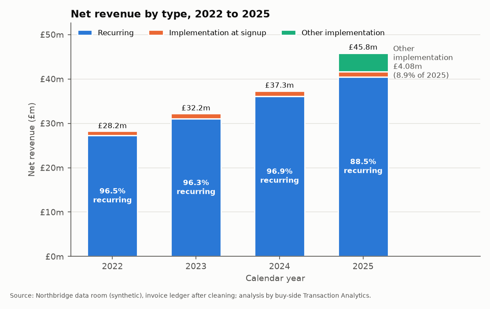
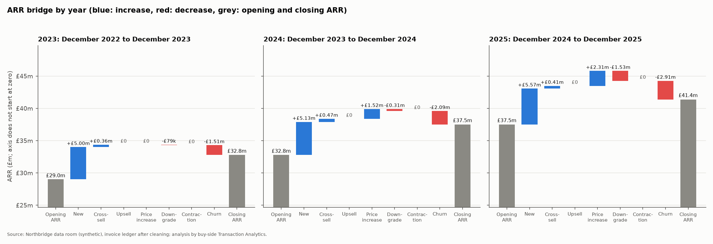
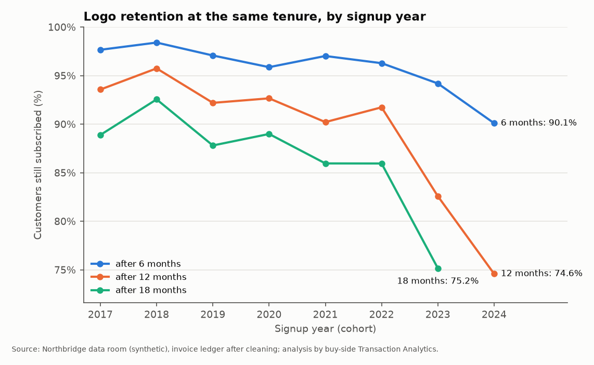

# Northbridge Software Ltd: buy-side financial due diligence

A self-directed simulation of the Transaction Analytics work on a buy-side deal, run on **synthetic data** for a fictional UK B2B SaaS company. It is not client work and uses no real company's data.

**Scenario.** A private equity fund is considering buying Northbridge Software Ltd (about £45.8m revenue in 2025). The seller's data room holds six tables: customers, products, subscriptions, 92,732 invoice lines, costs and monthly management accounts for January 2022 to December 2025.

**Method.** Profile and clean the data in SQL (DuckDB), logging every adjustment. Reconcile the invoice ledger to the management accounts month by month. Analyse revenue quality, concentration, cohorts, NRR and GRR, ARR and revenue bridges, margin and segments in Python notebooks. Present the results in an Excel databook with live formulas and TRUE/FALSE checks, a Power BI build plan with DAX and expected values, and a two-page memo. One command rebuilds everything, and pytest tie-outs check each step.

**Headline findings** (details in [`memo/findings_memo.pdf`](memo/findings_memo.pdf)):

- The ledger ties to the management accounts' product lines in all 48 months; reported 2025 revenue carries an unexplained £15,000 manual adjustment.
- 2025 revenue grew 22.8%, but 12.1% on recurring revenue: £4.08m of one-off implementation work was billed to existing customers in 2025.
- ARR reached £41.36m at December 2025, up 10.3%; before a 7% price increase on every line it grew 3.1%.
- NRR was 95.4% in 2025 (89.2% before price) and GRR 88.8%; customers who joined from 2023 keep 78.6% after 12 months against 92.5% before.
- The largest customer cut its ARR by 42.4% in September 2025. Recommendation: proceed, with price and structure protections.





**Repository.**

```
data/generator/   seeded generator for the data room (data/raw/ is rebuilt, not committed)
sql/              00_load, 01_profile, 02_clean, 03_revenue_cube, 04_reconciliation; analysis/ queries
notebooks/        02 preparation, 03 reconciliation, 04a-04g analyses, 04h key findings
outputs/          tables/ (feed the databook), charts/, key_findings.md
databook/         build_databook.py and Northbridge_Databook.xlsx
dashboard/        Power BI build plan, measures.dax, expected_values.csv
memo/             findings memo (md, docx, pdf)
docs/             data profile, cleaning log, data dictionary, metric definitions, Q&A log, decisions log
tests/            pytest tie-outs
```

**Reproduce.** `pip install -r requirements.txt`, install LibreOffice Calc and Writer (for example `apt-get install libreoffice-calc libreoffice-writer`), then `python run_all.py`. It takes a little over a minute. `python run_all.py --check-determinism` runs everything twice and confirms that every output is byte-for-byte identical.

**Tools.** Python (pandas, numpy, matplotlib, openpyxl, python-docx), SQL (DuckDB), Jupyter, pytest, LibreOffice, Power BI (DAX).
